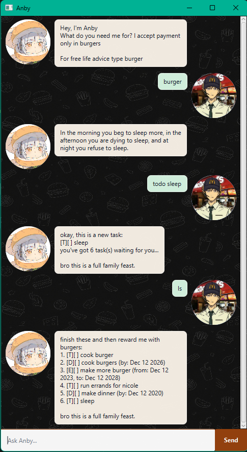

# Anby User Guide

Anby is a desktop task chatbot that helps you track todos, deadlines, and events.
It saves your tasks automatically and replies with a cheeky, burger-obsessed personality.



## Quick Start

1. Launch `anby.jar` or run the app from your IDE.
2. Type a command in the input box.
3. Press `Enter` or click `Send`.

## Command Summary

| Action | Format | Example                                                |
| --- | --- |--------------------------------------------------------|
| Add a todo | `todo DESCRIPTION` | `todo buy burgers`                                     |
| Add a deadline | `deadline DESCRIPTION /by YYYY-MM-DD` | `deadline work at macs /by 2028-06-23`                 |
| Add an event | `event DESCRIPTION /from YYYY-MM-DD /to YYYY-MM-DD` | `event burger tasting /from 2026-09-14 /to 2047-09-14` |
| List tasks | `list` | `list`                                                 |
| Mark task done | `mark TASK_NUMBER` | `mark 1`                                               |
| Mark task not done | `unmark TASK_NUMBER` | `unmark 2`                                             |
| Delete task | `delete TASK_NUMBER` | `delete 3`                                             |
| Find tasks | `find KEYWORD` | `find burger`                                          |
| Get a quote | `burger` | `burger`                                               |
| Exit | `bye` | `bye`                                                  |

Shortcuts are also available: `ls`, `m`, `um`, `del`, `q`, `t`, `d`, `e`, and `f`.

## Adding Todos

Adds a task without a date.

Example:

```text
todo buy burgers
```

Expected outcome: Anby adds the todo and shows the updated task count.

## Adding Deadlines

Adds a task that must be completed by a date.

Example:

```text
deadline work at macs /by 2028-06-23
```

Expected outcome: Anby adds a deadline with the date shown in a readable format.

## Adding Events

Adds a task with a start date and end date.

Example:

```text
event burger tasting /from 2026-09-14 /to 2047-09-14
```

Expected outcome: Anby adds an event if the start date is not after the end date.

## Listing Tasks

Shows all saved tasks.

Example:

```text
list
```

Expected outcome: Anby displays a numbered list of tasks. Use these numbers for
`mark`, `unmark`, and `delete`.

## Marking And Unmarking Tasks

Marks a task as done or not done.

Examples:

```text
mark 1
unmark 2
```

Expected outcome: Anby updates the selected task status.

## Deleting Tasks

Removes a task from the list.

Example:

```text
delete 3
```

Expected outcome: Anby removes the selected task and saves the updated list.

## Finding Tasks

Searches task descriptions for a keyword.

Example:

```text
find burger
```

Expected outcome: Anby shows only tasks whose descriptions contain the keyword.
The search is case-insensitive.

## Getting A Quote

Shows a random quote.

Example:

```text
burger
```

Expected outcome: Anby replies with one quote from its quote list.

## Exiting

Closes Anby.

Example:

```text
bye
```

Expected outcome: Anby says goodbye and the app closes shortly after.

## Notes

Dates must use `YYYY-MM-DD`, for example `2026-09-18`.
If Anby cannot understand a command, it will show an error message and an example
of a valid command.
